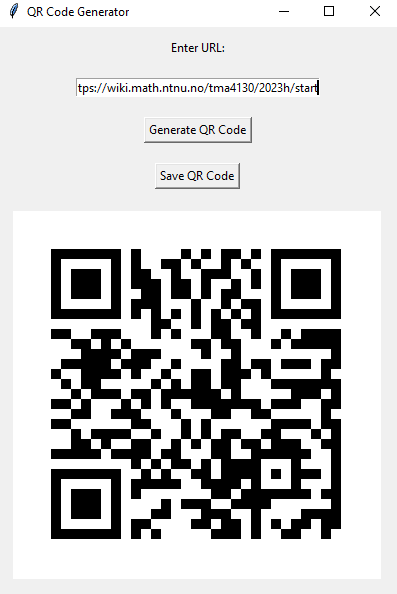

# QR Code Generator
This application is a simple command-line tool to generate QR codes from given URLs. The generated QR code is saved as an image file. It is also possible to run the application with a user interface. This is done by running the file "app.py" instead of "main.py".



## Requirements
* Python 3.x


## Installation
```bash
pip install qrcode 
```

## Usage
For CLI usage, run the file "main.py" with the following arguments:
```bash
python main.py --url <URL> [--filename <FILENAME>]
```
For the user interface, run the file "app.py" with the following command:
```bash
python app.py
```

### Arguments
* --url or -u: The URL to be encoded in the QR code. This argument is required.
* --filename or -f: The filename for the generated QR code image. This argument is optional and defaults to "qr.png".

### Example
To generate a QR code for the URL "https://wiki.math.ntnu.no/tma4130/2023h/start" and save it as "wiki.png":
```bash
python main.py --url "https://wiki.math.ntnu.no/tma4130/2023h/start" --filename "wiki.png"
```
